# 🔬 GraphRAG Research Assistant

> **Graph-Augmented Retrieval with Anti-Hallucination Verification**  
> Ask research questions. Get grounded, cited answers from 196,000+ academic papers — powered by Neo4j knowledge graphs, Supabase vector search, and Groq LLMs.

---

## 📋 Table of Contents

- [Overview](#-overview)
- [Architecture](#-architecture)
- [Features](#-features)
- [Tech Stack](#-tech-stack)
- [Project Structure](#-project-structure)
- [Prerequisites](#-prerequisites)
- [Setup & Installation](#-setup--installation)
- [Environment Variables](#-environment-variables)
- [Running the Project](#-running-the-project)
- [API Reference](#-api-reference)
- [Frontend Guide](#-frontend-guide)
- [Testing Connectivity](#-testing-connectivity)
- [Anti-Hallucination Pipeline](#-anti-hallucination-pipeline)
- [Troubleshooting](#-troubleshooting)

---

## 🧠 Overview

**GraphRAG Research Assistant v3.0** is a full-stack AI research tool that combines:

- **Graph-based retrieval** via Neo4j (196,875 nodes, 398,961 relationships across 111,896 publication nodes)
- **Vector similarity search** via Supabase pgvector
- **Large Language Models** via Groq API (Llama 3.1 / 3.3)
- **Anti-hallucination pipeline** with dual-pass verification and confidence scoring

It serves both a **REST API** (FastAPI) and a **browser-based frontend UI** from a single server.

---

## 🏗️ Architecture


## ✨ Features
## 🛡️ Anti-Hallucination Pipeline

The 6-step pipeline that prevents LLM fabrication:



1. **Intent Classification**: Identifies if the query is research, general, or chitchat.
2. **Keyword Extraction**: Parallel embedding and entity extraction.
3. **Graph Retrieval**: Neo4j seed expansion via `CITES` and `WRITTEN_BY` relationships.
4. **Vector Search**: Tiered similarity search via Supabase pgvector.
5. **Relevance Filter**: Strict floor filtering (default 0.25) to remove low-quality context.
6. **Verification Pass**: Dual-pass LLM fact-checking for a final `PASS/FAIL` verdict.
### 🔍 Retrieval Pipeline
- **Intent Classification** — auto-routes research vs. general/chitchat queries
- **Keyword Extraction** — extracts 3–5 search keywords from natural language
- **Graph Traversal** — Neo4j seed + expand via `CITES`, `WRITTEN_BY`, `PUBLISHED_IN` relationships
- **Tiered Vector Search** — seed papers searched first, then expanded neighbours
- **Reciprocal Rank Fusion (RRF)** — merges multiple result lists into a single ranked list

### 🌐 Frontend UI
- Dark-mode research assistant interface
- Conversation history sidebar
- Adjustable settings (Top K, Min Similarity, Model, Hallucination Check)
- System health monitor
- Quick-start suggestion cards

### 🔌 API Compatibility
- Native REST API (`/api/research`, `/api/chat`)
- **OpenAI-compatible endpoints** (`/v1/chat/completions`, `/v1/models`) — drop-in for OpenAI SDK clients

---

## 🛠️ Tech Stack

| Layer | Technology |
|---|---|
| **Backend Framework** | FastAPI 0.115 + Uvicorn |
| **Graph Database** | Neo4j Aura (cloud) |
| **Vector Database** | Supabase (PostgreSQL + pgvector) |
| **LLM Provider** | Groq API (Llama 3.1 8B / Llama 3.3 70B) |
| **Embedding Model** | `Snowflake/snowflake-arctic-embed-l-v2.0` via HuggingFace Inference API |
| **Frontend** | Vanilla HTML + CSS + JavaScript |
| **HTTP Client** | HTTPX (async) |
| **Data Validation** | Pydantic v2 |
| **Environment** | python-dotenv |

---

## 📁 Project Structure

```
testing/
├── app.py                  # Main FastAPI application (1261 lines)
├── run.py                  # Server entry point (Uvicorn)
├── test_connectivity.py    # Supabase + Neo4j connectivity tester
├── requirements.txt        # Python dependencies
├── .env                    # Your actual environment variables (git-ignored)
├── .env.example            # Template for environment variables
├── connectivity_report.json # Auto-generated by test_connectivity.py
└── frontend/
    ├── index.html          # Frontend UI (served at /app)
    ├── styles.css          # Dark-mode stylesheet
    └── app.js              # Frontend JavaScript logic
```

---

## 📦 Prerequisites

- Python **3.10+**
- A **Supabase** project with the `match_paper_chunks` RPC function deployed
- A **Neo4j Aura** (or self-hosted) instance with publication graph data
- A **Groq API** key — get one at [console.groq.com](https://console.groq.com)
- A **HuggingFace** token — get one at [huggingface.co/settings/tokens](https://huggingface.co/settings/tokens)

---

## 🚀 Setup & Installation

### 1. Clone / open the project

```bash
cd c:\Users\YourName\projects\testing
```

### 2. Create a virtual environment

```bash
python -m venv venv

# Windows
venv\Scripts\activate

# macOS / Linux
source venv/bin/activate
```

### 3. Install dependencies

```bash
pip install -r requirements.txt
```

### 4. Configure environment variables

```bash
# Copy the example file
copy .env.example .env   # Windows
cp .env.example .env     # macOS/Linux

# Then edit .env with your actual credentials
```

---

## 🔑 Environment Variables

Create a `.env` file in the project root with the following variables:

```env
# ── Required ─────────────────────────────────────────────────────────
SUPABASE_URL=https://your-project.supabase.co
SUPABASE_SERVICE_ROLE_KEY=your-service-role-key

NEO4J_URI=neo4j+s://your-instance.databases.neo4j.io
NEO4J_USER=neo4j
NEO4J_PASSWORD=your-neo4j-password

GROQ_API_KEY=your-groq-api-key
HF_TOKEN=your-huggingface-token

# ── Optional (defaults shown) ─────────────────────────────────────────
EMBED_MODEL=Snowflake/snowflake-arctic-embed-l-v2.0
REASON_MODEL=llama-3.1-8b-instant        # Fast model for routing & verification
HEAVY_MODEL=llama-3.3-70b-versatile      # Powerful model for deep research
MAX_GRAPH_NODES=20
GROQ_TIMEOUT=30
EMBED_TIMEOUT=10
RATE_LIMIT_PER_MIN=30
PORT=8000
ENV=dev
WORKERS=1
RELEVANCE_FLOOR=0.25                     # Minimum similarity to keep a chunk
```

> **Note:** Never commit your `.env` file to version control. Only commit `.env.example`.

---

## ▶️ Running the Project

### Start the server

```bash
python run.py
```

You will see:

```
Starting server...
INFO | graphrag | Frontend served at /app from ./frontend
INFO | Supabase connected
INFO | Neo4j connected
INFO | Application startup complete.
INFO | Uvicorn running on http://0.0.0.0:8000
```

### Access the application

| URL | Purpose |
|---|---|
| `http://localhost:8000/app` | 🖥️ **Frontend UI** (main interface) |
| `http://localhost:8000/docs` | 📖 **Swagger API docs** (interactive) |
| `http://localhost:8000/api/health` | 💚 **Health check** |
| `http://localhost:8000/api/health/full` | 🔍 **Full diagnostics** |

---

## 📡 API Reference

### `GET /api/health`
Quick health check.

```json
{
  "status": "ok",
  "service": "GraphRAG Research API",
  "version": "3.0.0",
  "ready": true,
  "neo4j": true,
  "features": ["anti-hallucination-verification", "relevance-filtering", "grounded-prompts", "multi-turn-chat"]
}
```

---

### `POST /api/research`
Main research query endpoint.

**Request:**
```json
{
  "query": "What are the latest advances in transformer architectures?",
  "top_k": 5,
  "min_similarity": 0.10,
  "use_heavy": false,
  "verify": true,
  "filters": {
    "year": 2023,
    "domain": "computer science"
  }
}
```

**Response:**
```json
{
  "request_id": "uuid",
  "answer": "According to [1]...",
  "intent": "research",
  "papers": [...],
  "chunks": [...],
  "verification": {
    "confidence": 0.92,
    "verified_claims": 8,
    "total_claims": 9,
    "flagged_claims": [],
    "verdict": "PASS"
  },
  "latency_ms": 3200,
  "model_used": "llama-3.1-8b-instant",
  "warning": null
}
```

---

### `POST /api/chat`
Multi-turn conversation with RAG context.

**Request:**
```json
{
  "messages": [
    {"role": "user", "content": "Tell me about graph neural networks."},
    {"role": "assistant", "content": "Graph neural networks (GNNs)..."},
    {"role": "user", "content": "How do they compare to transformers?"}
  ],
  "top_k": 5,
  "min_similarity": 0.10,
  "use_heavy": false,
  "verify": true
}
```

---

### `POST /api/research/bulk`
Batch multiple research queries (max 10).

**Request:**
```json
{
  "queries": ["What is RAG?", "Explain knowledge graphs"],
  "top_k": 3
}
```

---

### `GET /v1/models` · `POST /v1/chat/completions`
OpenAI-compatible endpoints. Drop-in replacement for OpenAI SDK clients pointing to `http://localhost:8000`.

---

## 🖥️ Frontend Guide

The frontend is served automatically at `http://localhost:8000/app`.

### Settings Panel (left sidebar)

| Setting | Default | Description |
|---|---|---|
| **Top K Results** | 5 | Number of paper chunks to retrieve |
| **Min Similarity** | 0.10 | Minimum vector similarity threshold (0.0–1.0) |
| **Model** | Fast (8B) | `Fast (8B)` = Llama 3.1 · `Heavy (70B)` = Llama 3.3 |
| **Hallucination Check** | ON | Enable dual-pass verification |

### Using the UI

1. Type your research question in the input box at the bottom
2. Press **Enter** to send (or **Shift+Enter** for a new line)
3. The response includes:
   - A grounded answer with inline citations `[1]`, `[2]`, etc.
   - Source papers used
   - Verification confidence score
4. Use the **quick suggestion cards** for popular topics
5. Your conversation history appears in the left sidebar

---

## 🧪 Testing Connectivity

Run the connectivity tester to verify all services before starting:

```bash
python test_connectivity.py
```

**What it checks:**
- ✅ All environment variables are set
- ✅ Supabase client creation & REST API health
- ✅ Supabase `match_paper_chunks` RPC function
- ✅ Neo4j driver creation & connectivity verification
- ✅ Neo4j server info, ping query, node/relationship counts
- ✅ Graph schema (labels & relationship types)
- ✅ Publication node count + sample titles

**Output:** A `connectivity_report.json` file is saved with full diagnostic results.

**Exit codes:**
| Code | Meaning |
|---|---|
| `0` | All services connected |
| `1` | Partial connectivity |
| `2` | No services connected |

---

## 🛡️ Anti-Hallucination Pipeline

The 6-step pipeline that prevents LLM fabrication:

```
Query
  │
  ▼
1. Intent Classification (research / general / chitchat)
  │
  ▼
2. Keyword Extraction + Embedding (parallel)
  │
  ▼
3. Graph Retrieval (Neo4j seed → expand via CITES / WRITTEN_BY / PUBLISHED_IN)
  │
  ▼
4. Vector Search (tiered: seed papers first, then expanded neighbours) + RRF Fusion
  │
  ▼
5. Relevance Filter (drop chunks < 0.25 similarity)
  │
  ▼
6. Grounded LLM Answer (temperature=0, mandatory citations)
  │
  ▼
7. Verification Pass (second LLM checks every claim → confidence + verdict)
  │
  ▼
Final Response with verification report
```

---

## 🔧 Troubleshooting

### Server won't start
- Check all required environment variables are set in `.env`
- Ensure the virtual environment is activated: `venv\Scripts\activate`
- Run `python test_connectivity.py` to isolate which service is failing

### Neo4j connection timeout
- Neo4j Aura free tier **pauses after inactivity** — log in at [console.neo4j.io](https://console.neo4j.io) and resume your instance
- The app runs in **degraded mode** if Neo4j is unavailable (falls back to vector-only search)

### Supabase RPC not found
- The `match_paper_chunks` PostgreSQL function must be deployed in your Supabase project
- Check the SQL functions section in your Supabase dashboard

### Embedding errors
- Verify your `HF_TOKEN` is valid and has access to the embedding model
- Try increasing `EMBED_TIMEOUT` in `.env` if it times out

### Rate limit errors (429)
- The API has a default limit of **30 requests/minute per IP**
- Adjust `RATE_LIMIT_PER_MIN` in `.env` to increase it

---

## 📄 License

This project is for research and educational purposes.

---

*Built with ❤️ using FastAPI, Neo4j, Supabase, Groq, and HuggingFace*


taskkill /IM python.exe /F


plnning to implement


                ┌──────────────┐
                │   User Query │
                └──────┬───────┘
                       ↓
               Intent Detection
                       ↓
     ┌──────────────┬──────────────┬──────────────┐
     ↓              ↓              ↓
 Title Query   Metadata Query   Concept Query
     ↓              ↓              ↓
 Graph + ID     Graph Only     Supabase First
     ↓                             ↓
 Supabase (by ID)              Graph Expand
     ↓                             ↓
           LLM (Grounded Answer)
