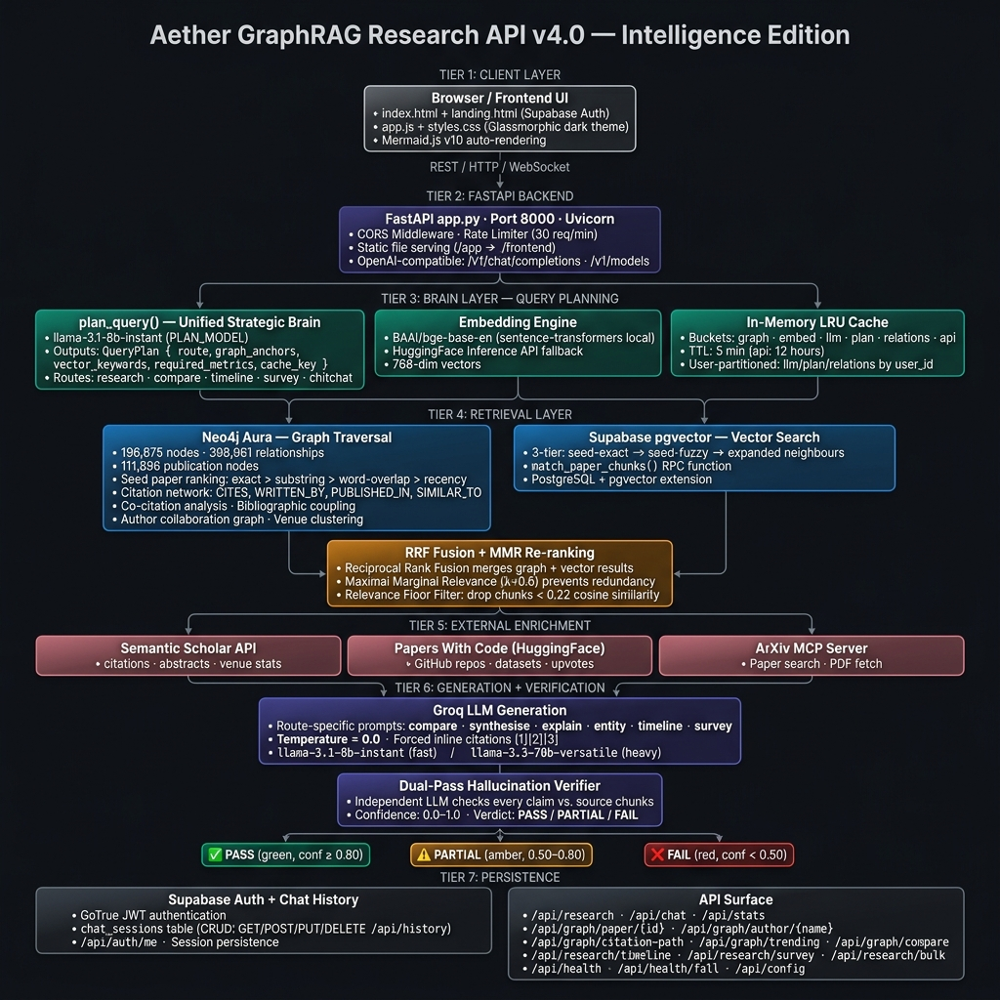
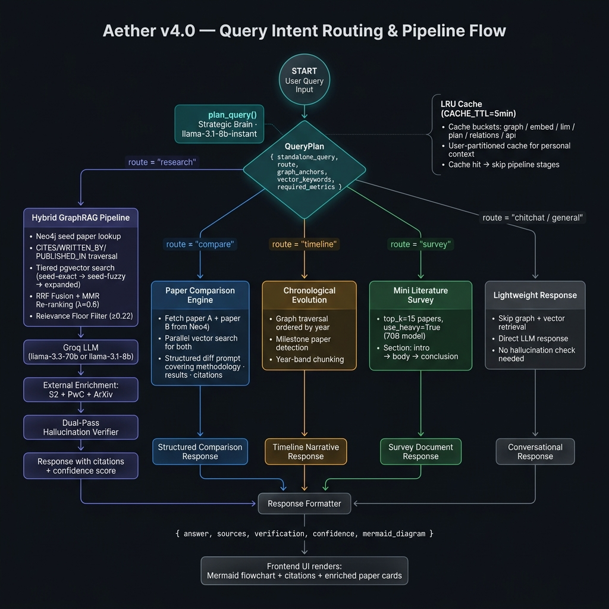

# 🔬 GraphRAG Research Assistant

> **Graph-Augmented Retrieval with Academic Source Enrichment & Anti-Hallucination Verification**  
> Ask research questions. Get grounded, cited answers enriched with Semantic Scholar stats and official code repositories — powered by Neo4j knowledge graphs, Supabase vector search, and Groq LLMs.

---

## 📋 Table of Contents

- [Overview](#-overview)
- [Architecture](#-architecture)
- [Features](#-features)
- [Tech Stack](#-tech-stack)
- [Project Structure](#-project-structure)
- [Prerequisites](#-prerequisites)
- [Setup & Installation](#-setup--installation)
- [Environment Variables](#-environment-variables)
- [Running the Project](#-running-the-project)
- [API Reference](#-api-reference)
- [Frontend Guide](#-frontend-guide)
- [Testing Connectivity](#-testing-connectivity)
- [Anti-Hallucination Pipeline](#-anti-hallucination-pipeline)
- [Troubleshooting](#-troubleshooting)

---

## 🧠 Overview

**GraphRAG Research Assistant v4.0 — Aether Intelligence Edition** is a full-stack AI research tool that combines:

- **Graph-based retrieval** via Neo4j Aura (196,875 nodes, 398,961 relationships across 111,896 publication nodes)
- **Vector similarity search** via Supabase pgvector (3-tier: seed-exact → seed-fuzzy → expanded neighbours)
- **Academic Source Enrichment** via Semantic Scholar API, Papers With Code, and ArXiv MCP Server
- **Large Language Models** via Groq API (Llama 3.3 70B / Llama 3.1 8B)
- **Unified Query Planning Brain** (`plan_query()`) — single LLM call producing a structured `QueryPlan` with route, graph anchors, vector keywords, and cache key
- **MMR diversity re-ranking** (Maximal Marginal Relevance, λ=0.6) to prevent redundant results
- **Anti-hallucination pipeline** with dual-pass verification and confidence scoring (PASS / PARTIAL / FAIL)
- **Supabase Authentication** for secure user login and conversation persistence
- **In-memory LRU cache** with user-partitioned buckets (graph · embed · llm · plan · relations · api)

It serves both a **REST API** (FastAPI) and a **browser-based frontend UI** from a single server.


---

## 🏗️ Architecture



---

## ✨ Features

### 🔍 Advanced Hybrid Retrieval Pipeline
- **Unified Query Planning Brain** — `plan_query()` (single LLM call via `llama-3.1-8b-instant`) produces a `QueryPlan` with: route, graph anchors, vector keywords, required metrics, and a deterministic cache key.
- **Intent Routing** — auto-routes to: `research`, `compare`, `timeline`, `survey`, or `chitchat`.
- **Graph Traversal** — Neo4j seed paper ranking (exact → substring → word-overlap → recency) + expand via `CITES`, `WRITTEN_BY`, `PUBLISHED_IN`, `SIMILAR_TO` relationships.
- **Co-citation Analysis** — Bibliographic coupling, author collaboration graph, venue clustering.
- **3-Tier Vector Search** — seed-exact → seed-fuzzy → expanded graph neighbours via Supabase pgvector.
- **RRF Fusion + MMR Re-ranking** — Reciprocal Rank Fusion merges lists; Maximal Marginal Relevance (λ=0.6) prevents redundancy.
- **Relevance Floor Filter** — drops chunks below 0.22 cosine similarity.
- **Non-blocking Async Offloading** — Neo4j and Supabase operations run in async threads, preserving FastAPI event loop throughput.

### 🌐 Academic Source & Code Enrichment
- **Semantic Scholar Integration** — automatically retrieves up-to-date citation counts, paper abstracts, and venue statistics.
- **Papers With Code Integration** — extracts official code repositories (GitHub), linked models, datasets, and upvote metrics.
- **ArXiv MCP Server** — dedicated MCP sidecar (`arxiv-mcp-server/`) for paper search and full PDF fetch.

### 🛡️ Anti-Hallucination Pipeline
A rigorous 7-step pipeline prevents LLM fabrication:
1. **Intent Classification**: Routing of query.
2. **Keyword Extraction**: Embedding + entity extraction.
3. **Graph Retrieval**: Neo4j seed expansion.
4. **Vector Search**: Tiered pgvector search.
5. **Relevance Filter**: Strict floor filtering (default `0.25`) to remove low-quality context.
6. **Grounded Answer**: Zero-temperature prompting with mandatory inline citations.
7. **Verification Pass**: Dual-pass LLM fact-checking for a final `PASS/FAIL` verdict with confidence scoring.



### 🖥️ Modern Frontend UI
- Premium dark-mode research assistant interface.
- **Supabase Authentication** with login/signup flow (`landing.html`).
- **Robust Mermaid Rendering** with `mermaid.parse` validation and auto-healing/sanitization (prevents syntax errors from breaking the UI).
- Conversation history sidebar synced via Supabase backend.
- Adjustable parameters (Top K, Min Similarity, Model, Hallucination Check).
- System health monitor.

### 🔌 API Compatibility
- Native REST API: `/api/research`, `/api/chat`, `/api/history`, `/api/stats`
- **Graph endpoints**: `/api/graph/paper/{id}`, `/api/graph/author/{name}`, `/api/graph/citation-path`, `/api/graph/trending`, `/api/graph/compare`
- **Research modes**: `/api/research/timeline`, `/api/research/survey`, `/api/research/bulk`
- **OpenAI-compatible endpoints** (`/v1/chat/completions`, `/v1/models`) — drop-in for OpenAI SDK clients.

---

## 🛠️ Tech Stack

| Layer | Technology |
|---|---|
| **Backend Framework** | FastAPI 0.115 + Uvicorn |
| **Graph Database** | Neo4j Aura (cloud) |
| **Vector Database** | Supabase (PostgreSQL + pgvector) |
| **LLM Provider** | Groq API — `llama-3.1-8b-instant` (plan/fast) · `llama-3.3-70b-versatile` (heavy) |
| **Embedding Model** | `BAAI/bge-base-en` (local via `sentence-transformers`; HuggingFace Inference API fallback) |
| **Query Planning** | `plan_query()` — unified brain producing structured `QueryPlan` JSON |
| **Re-ranking** | Reciprocal Rank Fusion (RRF) + Maximal Marginal Relevance (MMR, λ=0.6) |
| **Caching** | In-memory LRU (6 buckets, user-partitioned, TTL 5 min / 12 hr for API) |
| **Authentication** | Supabase Auth (GoTrue JWT) |
| **Frontend** | HTML5 + CSS3 (Glassmorphic) + Vanilla JavaScript |
| **Diagram Engine** | Mermaid.js v10 (with custom error handling & auto-sanitizer) |
| **External Sources** | Semantic Scholar API · Papers With Code · ArXiv MCP Server |

---

## 📁 Project Structure

```
GraphRag-Research-Assistant/
├── api/
│   └── index.py                      # Vercel serverless entry point
├── app/
│   ├── app.py                        # Main FastAPI application & all API routes (v4.0)
│   ├── embeddingService/
│   │   └── embeddings.py             # Local BAAI/bge-base-en + HF API fallback
│   └── sources/
│       ├── semantic_scholar.py       # Semantic Scholar citation & abstract enrichment
│       ├── papers_with_code.py       # GitHub repos, datasets & upvote enrichment
│       └── arxiv_mcp.py              # ArXiv MCP connector (paper search + PDF fetch)
├── arxiv-mcp-server/
│   ├── mcp_server.py                 # Standalone ArXiv MCP sidecar server
│   ├── Dockerfile                    # Container for MCP server
│   └── requirements.txt
├── frontend/
│   ├── index.html                    # Main chat interface
│   ├── landing.html                  # Secure Login/Signup landing page
│   ├── app.js                        # Frontend logic (Supabase auth, query processing, Mermaid rendering)
│   └── styles.css                    # Dark-theme glassmorphic stylesheet
├── ingestion/
│   ├── ingestIntoSupabase.py         # Primary ingestion script
│   └── scripttouploadpaperchunkstable.py  # Paper chunks uploader
├── docs/
│   └── vercel_bundle_size_resolution.md  # Deployment notes
├── tests/                            # Backend tests
├── brain/                            # Conversation history (local dev only)
├── requirements.txt                  # Python dependencies
├── requirements-local.txt            # Local-only dependencies (sentence-transformers)
├── .env                              # Environment variables (git-ignored)
├── vercel.json                       # Vercel deployment configuration
├── test_prompt.py                    # LLM prompt validation script
└── test_sources.py                   # Sources enrichment integration validation script
```

---

## 📦 Prerequisites

- Python **3.10+**
- A **Supabase** project with the `match_paper_chunks` RPC function and `chat_sessions` table deployed.
- A **Neo4j Aura** (or self-hosted) instance with publication graph data.
- A **Groq API** key — get one at [console.groq.com](https://console.groq.com).
- A **HuggingFace** token (optional, used as fallback for embeddings if `sentence-transformers` is running on cloud platforms like Vercel).

---

## 🚀 Setup & Installation

### 1. Clone the project

```bash
cd c:\Users\YourName\projects\GraphRag-Research-Assistant
```

### 2. Create a virtual environment

```bash
python -m venv venv

# Windows
venv\Scripts\activate

# macOS / Linux
source venv/bin/activate
```

### 3. Install dependencies

```bash
pip install -r requirements.txt
```

### 4. Configure environment variables

```bash
# Copy the example file
copy .env.example .env   # Windows
cp .env.example .env     # macOS/Linux

# Then edit .env with your actual credentials
```

---

## 🔑 Environment Variables

Create a `.env` file in the project root with the following variables:

```env
# ── Required ─────────────────────────────────────────────────────────
SUPABASE_URL=https://your-project.supabase.co
SUPABASE_SERVICE_ROLE_KEY=your-service-role-key
SUPABASE_KEY=your-anon-public-key

NEO4J_URI=neo4j+s://your-instance.databases.neo4j.io
NEO4J_USER=neo4j
NEO4J_PASSWORD=your-neo4j-password

GROQ_API_KEY=your-groq-api-key
HF_TOKEN=your-huggingface-token

# ── Optional (defaults shown) ─────────────────────────────────────────
EMBED_MODEL=BAAI/bge-base-en
REASON_MODEL=llama-3.1-8b-instant        # Fast model for routing & verification
HEAVY_MODEL=llama-3.3-70b-versatile      # Powerful model for deep research
MAX_GRAPH_NODES=20
GROQ_TIMEOUT=30
EMBED_TIMEOUT=10
RATE_LIMIT_PER_MIN=30
PORT=8000
ENV=dev
WORKERS=1
RELEVANCE_FLOOR=0.25                     # Minimum similarity to keep a chunk
```

---

## ▶️ Running the Project

### Start the server locally

```bash
python -m app.app
```

You will see:

```
Starting server...
INFO | graphrag | Frontend served at /app from ./frontend
INFO | Supabase connected
INFO | Neo4j connected
INFO | Application startup complete.
INFO | Uvicorn running on http://0.0.0.0:8000
```

### Run on Vercel locally

```bash
vercel dev
```

### Access the application

| URL | Purpose |
|---|---|
| `http://localhost:8000/app` | 🖥️ **Frontend UI** (redirects to `/app/landing.html` if unauthenticated) |
| `http://localhost:8000/docs` | 📖 **Swagger API docs** (interactive) |
| `http://localhost:8000/api/health` | 💚 **Health check** |
| `http://localhost:8000/api/health/full` | 🔍 **Full diagnostics** |

---

## 📡 API Reference

### `GET /api/health`
Quick health check.

```json
{
  "status": "ok",
  "service": "GraphRAG Research API",
  "version": "5.0.0",
  "ready": true,
  "neo4j": true,
  "features": ["anti-hallucination-verification", "relevance-filtering", "grounded-prompts", "multi-turn-chat", "academic-enrichment"]
}
```

---

### `POST /api/research`
Main research query endpoint.

**Request:**
```json
{
  "query": "What are the latest advances in transformer architectures?",
  "top_k": 5,
  "min_similarity": 0.10,
  "use_heavy": false,
  "verify": true,
  "filters": {
    "year": 2023,
    "domain": "computer science"
  }
}
```

---

### `POST /api/chat`
Multi-turn conversation with RAG context.

**Request:**
```json
{
  "messages": [
    {"role": "user", "content": "Tell me about graph neural networks."},
    {"role": "assistant", "content": "Graph neural networks (GNNs)..."},
    {"role": "user", "content": "How do they compare to transformers?"}
  ],
  "top_k": 5,
  "min_similarity": 0.10,
  "use_heavy": false,
  "verify": true
}
```

---

### `GET /api/history` · `POST /api/history` · `DELETE /api/history/{session_id}`
Endpoints for listing, saving, and deleting user chat sessions synced to the Supabase database.

---

## 🖥️ Frontend Guide

### Settings Panel (left sidebar)

| Setting | Default | Description |
|---|---|---|
| **Top K Results** | 5 | Number of paper chunks to retrieve |
| **Min Similarity** | 0.10 | Minimum vector similarity threshold (0.0–1.0) |
| **Model** | Fast (8B) | `Fast (8B)` = Llama 3.1 · `Heavy (70B)` = Llama 3.3 |
| **Hallucination Check** | ON | Enable dual-pass verification |

### Using the UI

1. Authenticate via the Login/Signup page (`landing.html`).
2. Type your research question in the input box at the bottom.
3. The response includes:
   - A grounded answer with inline citations `[1]`, `[2]`, etc.
   - Enriched source papers (citations, code, upvotes).
   - An interactive visual flowchart (auto-rendered via Mermaid.js).
   - Verification confidence score.

---

## 🧪 Testing Connectivity

Run the connectivity tester to verify all services before starting:

```bash
python test_connectivity.py
```

**What it checks:**
- ✅ All environment variables are set
- ✅ Supabase client creation & REST API health
- ✅ Supabase `match_paper_chunks` RPC function
- ✅ Neo4j driver creation & connectivity verification
- ✅ Neo4j server info, ping query, node/relationship counts
- ✅ Graph schema (labels & relationship types)
- ✅ Publication node count + sample titles

**Output:** A `connectivity_report.json` file is saved with full diagnostic results.

---

## 🔧 Troubleshooting

### Server won't start
- Check all required environment variables are set in `.env`
- Ensure the virtual environment is activated: `venv\Scripts\activate`
- Run `python test_connectivity.py` to isolate which service is failing

### Neo4j connection timeout
- Neo4j Aura free tier **pauses after inactivity** — log in at [console.neo4j.io](https://console.neo4j.io) and resume your instance
- The app runs in **degraded mode** if Neo4j is unavailable (falls back to vector-only search)

### Supabase RPC not found
- The `match_paper_chunks` PostgreSQL function must be deployed in your Supabase project

### Embedding errors
- Verify your `HF_TOKEN` is valid and has access to the embedding model if running on Vercel
- Verify `sentence-transformers` is installed for local execution

---

## 📄 License

This project is licensed under the **Apache License 2.0**.
See the [LICENSE](LICENSE) file for full terms.

---

*Built with ❤️ using FastAPI, Neo4j, Supabase, Groq, and HuggingFace*
